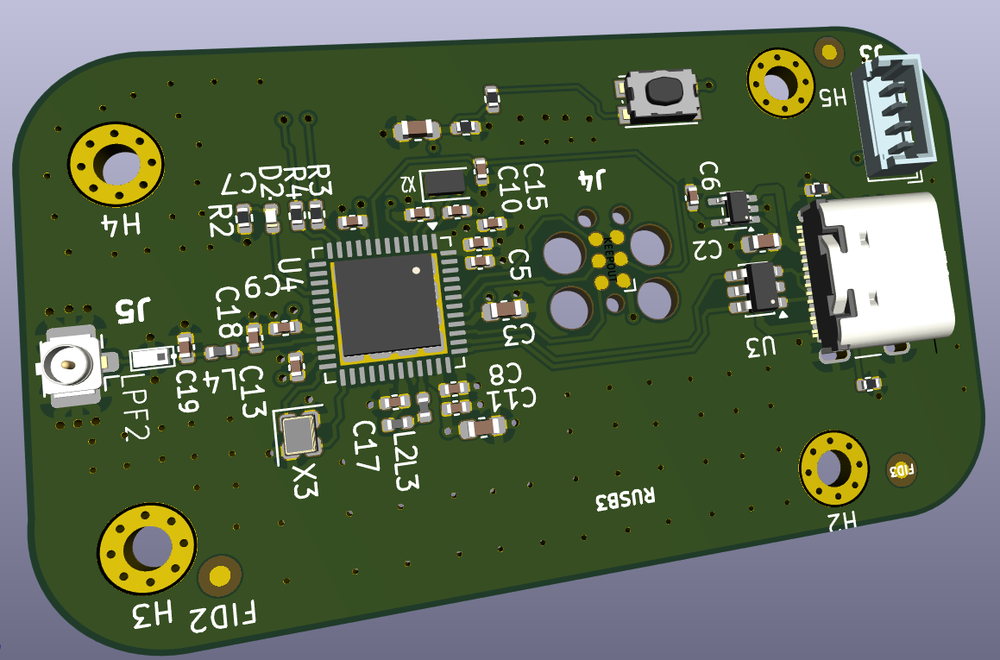
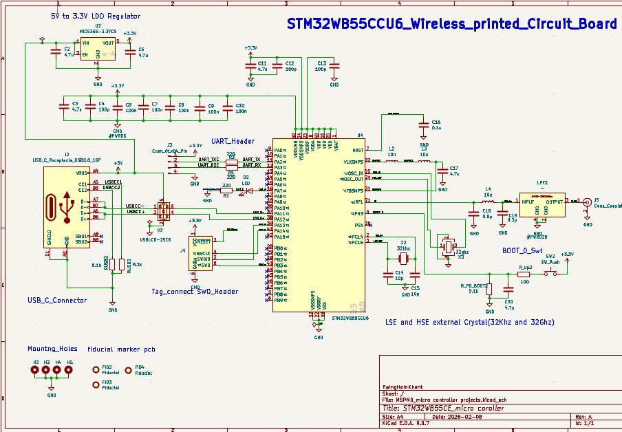
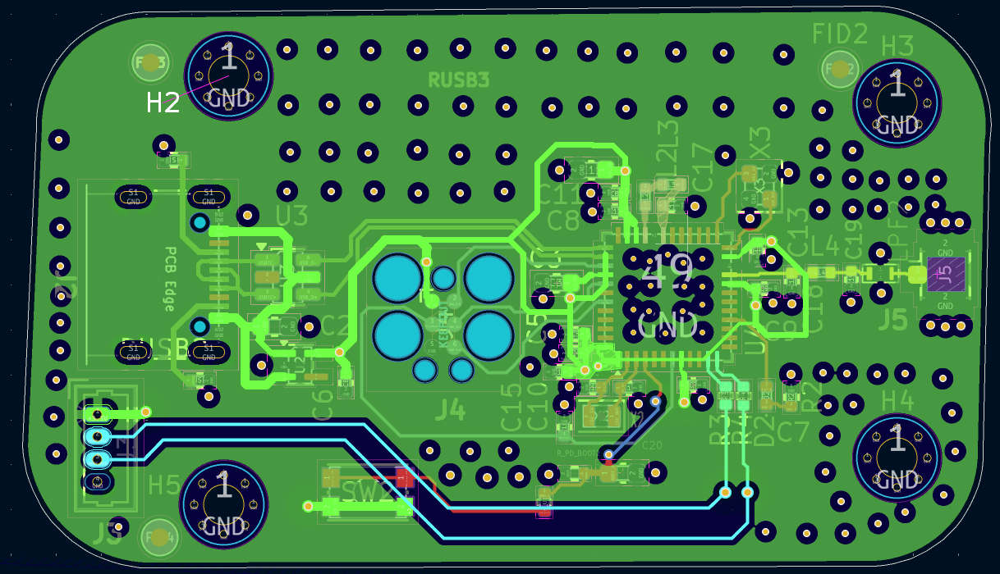

# STM32 Wireless RF Communication Platform (Pre-Fabrication)

**KiCad 9 | 4-Layer PCB | Sub-GHz RF | 50Ω Matching**

---

## 1. The Problem This Board Tries to Solve

This design comes from a fairly common issue in mixed-signal systems:

RF performance tends to degrade once digital activity and power noise are introduced, even if the schematic looks correct.

In this case, the board combines:
- A wireless MCU  
- A USB interface  
- A shared power system  

Functionally, this is straightforward. The difficulty is whether the RF path maintains acceptable performance once everything is active.

The focus here is not feature integration—it is **how RF behaves in the presence of digital noise and shared infrastructure**.

---

## 2. Physical Design — Where the Strategy Becomes Visible

Looking at the board in 3D makes the placement decisions clearer than the schematic alone.

A few things were done intentionally:

- The RF connector is placed at the board edge to define a clean launch region  
- The MCU is kept central to avoid pushing digital routing toward the antenna  
- USB and power sections are positioned away from the RF path where possible  

That said, this is still a compact board. While the domains are visually separated, they are not electrically isolated.

They still share:
- The same ground plane  
- The same 3.3V rail  

So the question becomes less about placement alone, and more about how effective that separation really is.

---

** Review Question**  
Does physical separation meaningfully reduce RF interference without electrical isolation?

---

## 3. System Architecture — Where Noise Paths Are Defined

The schematic makes it clear how everything reconnects.

Key points:

- The RF output relies on a discrete matching network  
- USB introduces high-speed differential signals  
- RF and digital blocks share a single regulated 3.3V supply  

From a connectivity standpoint, everything is tied together. There’s no true isolation between domains.

So even if the layout is careful:
- Noise on the power rail can propagate  
- Return currents share the same ground reference  

At this stage, the design is already constrained by those shared paths.

---

**Review Question**  
Which path dominates RF degradation: power coupling, ground return, or direct radiation?

---

## 4. RF Path — Clean on Paper, Exposed in Reality

The RF routing itself follows standard practice:

- The trace is short and direct  
- No vias are used in the RF path  
- Matching components are placed close to the RF pin  

From a pure RF routing perspective, this is reasonable.

However, the surrounding context matters.

There is still:
- Digital routing in relatively close proximity  
- USB-related signals within the same layer environment  

Even with a continuous ground plane, coupling is still possible through:
- Electric fields  
- Harmonic content from switching signals  

So while the RF trace is controlled, it is not operating in a quiet environment.

---

**Review Question**  
At what point does nearby digital routing begin to impact RF performance?

---

## 5. The Hidden Layer — Return Current Behavior

The bottom layer is where the more subtle behavior shows up.

There is:
- A continuous ground plane beneath the RF trace  
- Extensive via stitching  
- No segmentation between RF and digital return paths  

This means all return currents share the same plane.

In theory, RF return current should stay directly under its trace. In practice, other currents—especially from USB and digital switching—are using that same reference.

If those currents overlap in space and frequency, they can introduce noise into the RF loop.

This is one of the areas where performance issues tend to show up after fabrication.

---

**Review Question**  
Do high-frequency return currents from USB overlap the RF return path?

---

## 6. RF Matching Network — Designed, But Not Yet Proven

The matching network is implemented as a discrete L/C network placed close to the RF output.

From a layout standpoint, the placement is correct.

However, the actual impedance depends on several factors that aren’t fully controlled at this stage:

- PCB dielectric variation  
- Component tolerances and parasitics  
- Antenna impedance  

So while the design targets 50Ω, that’s still an assumption until measured.

---

**Review Question**  
What does the measured S11 look like after fabrication?

---

## 7. Power System — The Silent Coupling Channel

The board uses a single power path:

- USB-C input  
- LDO regulation  
- Shared 3.3V rail for RF and digital  

This simplifies the design, but it also creates a direct coupling path.

Digital activity—especially from USB—introduces:
- Transient current spikes  
- Broadband noise  

That noise is present on the same supply used by the RF front-end.

Depending on how well it is decoupled, this can affect:
- Noise floor  
- Receiver sensitivity  

---

**Review Question**  
What level of supply noise reaches the RF front-end during active USB operation?

---

## 8. What This Design Is Really Testing

At a higher level, this board is exploring a few practical trade-offs:

- Physical separation vs shared electrical paths  
- Controlled impedance vs real-world variation  
- Clean routing vs mixed-signal interference  

The layout reflects an attempt to manage these, but not eliminate them.

---

## 9. Known Risks

Based on the current design:

- RF and digital return paths are shared  
- Power rail is common to all domains  
- Matching network is not yet validated  
- Digital routing exists near RF structures  
- USB activity may introduce measurable interference  

---

## 10. Validation — Where the Design Gets Verified

To understand how the board actually performs:

- **VNA testing** will be used to measure S11 and adjust matching  
- **Spectrum analysis** will identify unwanted emissions  
- **Range testing** will evaluate real-world link performance  
- **Power analysis** will look at ripple and transient behavior  

---

## 11. Final Perspective

This is not a fully optimized RF design.

It is a controlled implementation that keeps the main variables visible:

- Shared power  
- Shared ground  
- Mixed-signal proximity  

The goal is to see how these factors interact after fabrication, rather than assuming ideal behavior upfront.

---
