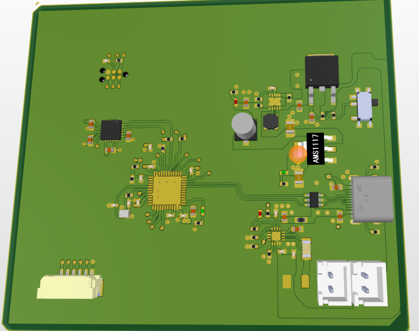
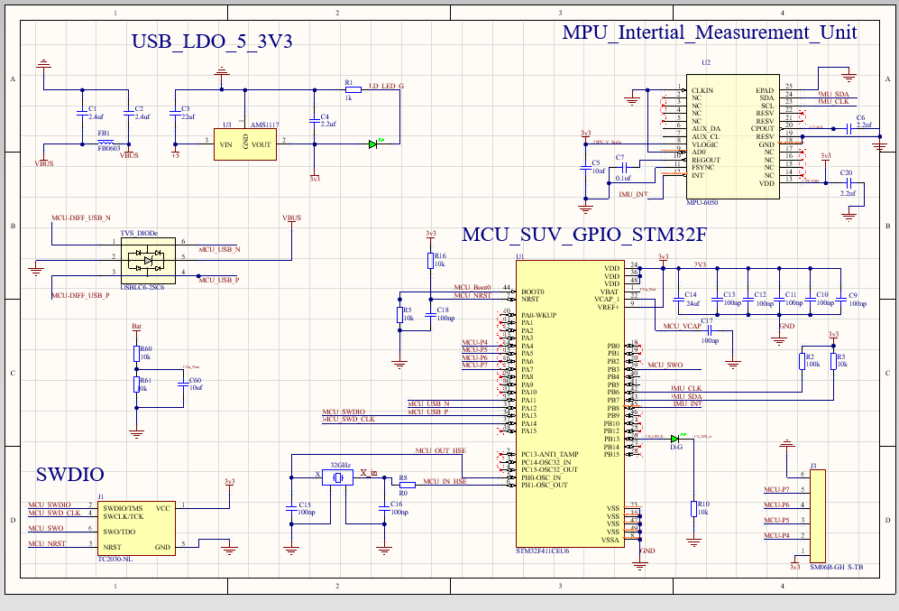
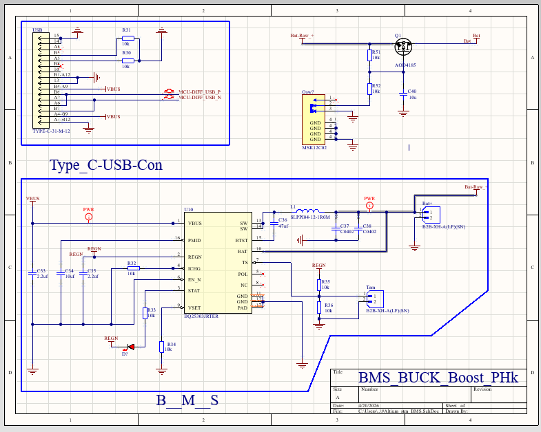
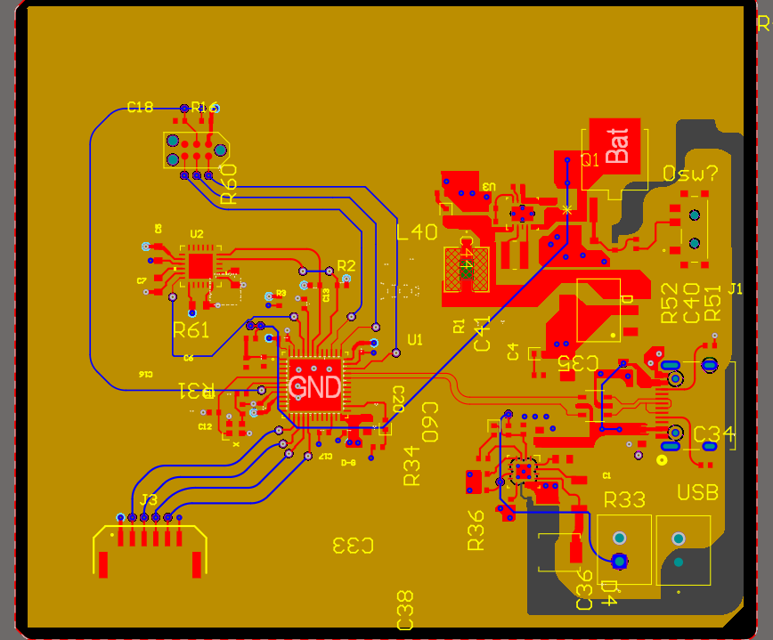
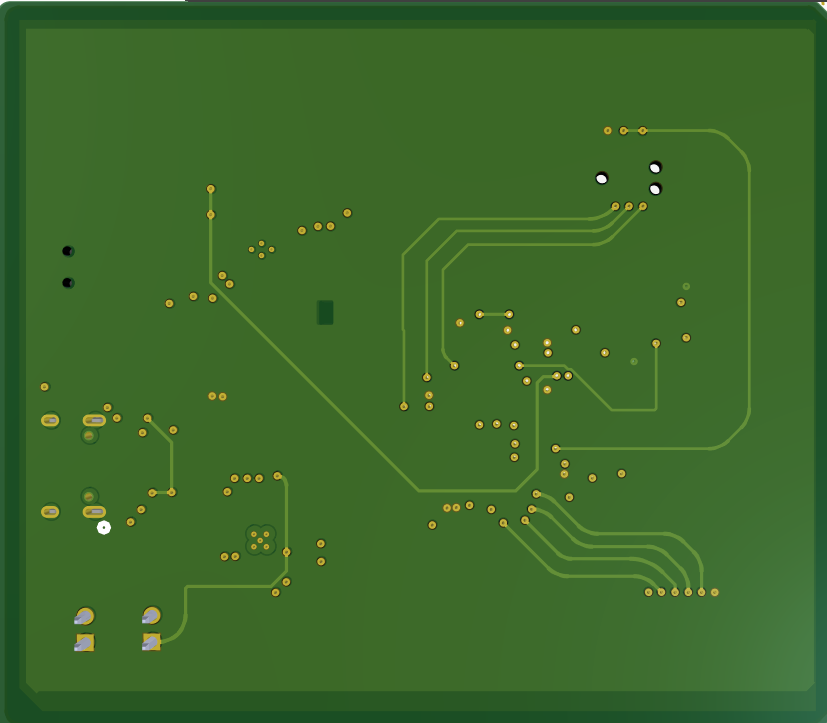

# STM32 Mixed-Signal Control Board [Pre-Fabrication]

**Altium Designer | 4-Layer PCB | STM32F411 | Power Management | Signal Integrity**

---

## System Overview

This project is a **pre-fabrication embedded hardware design** integrating power management, microcontroller, and motion sensing into a compact 4-layer PCB.

The primary design focus is maintaining **signal integrity for low-level sensor communication** while managing **switching noise from the power stage**.

  

  

<em>*3D view used to verify component placement, connector accessibility, and overall board integration.*

---

## System Architecture

The design is partitioned into functional domains to reduce interference between subsystems:

- **Control Domain:** STM32F411CEU6 (Cortex-M4)  
- **Sensor Domain:** MPU-6050 (I2C interface)  
- **Power Domain:** Buck-boost regulation + Li-ion charging  

### Schematic Overview

*MCU and IMU interface showing short I2C routing and local decoupling.*

*Power subsystem integrating Li-ion charging and regulation.*

---

## PCB Stackup & Layout 

A 4-layer stackup is used to manage return paths and reduce noise coupling:

- **Top Layer:** Critical routing and component placement  
- **Inner Layer 1:** Continuous ground plane  
- **Inner Layer 2:** 3.3V power distribution  
- **Bottom Layer:** Low-speed routing and signal breakout  

### Layout Overview

*Top layer showing separation between power stage and control region.*

*Bottom layer used for signal escape routing and test access.*

---

## Design Considerations

### Power Integrity

- Buck-boost regulator selected to maintain stable system voltage under varying battery conditions  
- High current paths kept short to reduce resistive losses and noise coupling  

---

### EMI Mitigation

- Switching loop area minimized around regulator and inductor  
- Power stage physically separated from MCU and IMU regions  
- Continuous ground reference used to control return currents  

---

### Signal Integrity (I2C / Sensor)

- Short SDA/SCL routing to reduce parasitic effects  
- Ground reference maintained beneath signal traces  
- Avoided routing near switching nodes  

---

### Thermal Handling

- Power components placed with copper area for heat spreading  
- Thermal vias used to transfer heat into internal planes  

---

## Design Review Notes

- Identified critical switching current loops and minimized their area  
- Maintained separation between noisy and sensitive domains  

**Potential risks:**
- Noise coupling from power stage into sensor lines  
- Transient response under dynamic load  

---

## Project Status

- PCB design complete  
- Not yet fabricated or electrically validated  

---

## Planned Validation

- Power rail measurement (ripple, stability)  
- Thermal observation under load  
- STM32 bring-up and IMU communication testing  

---
