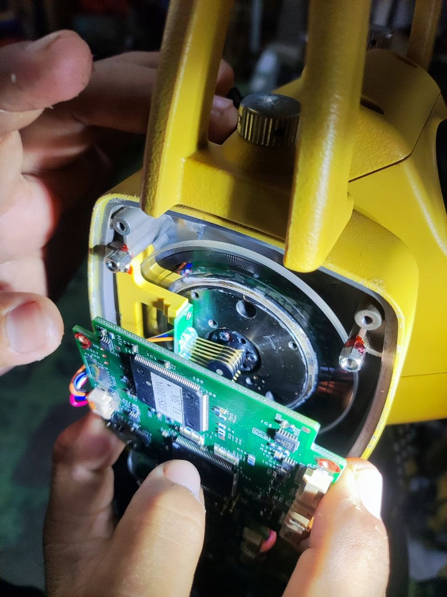
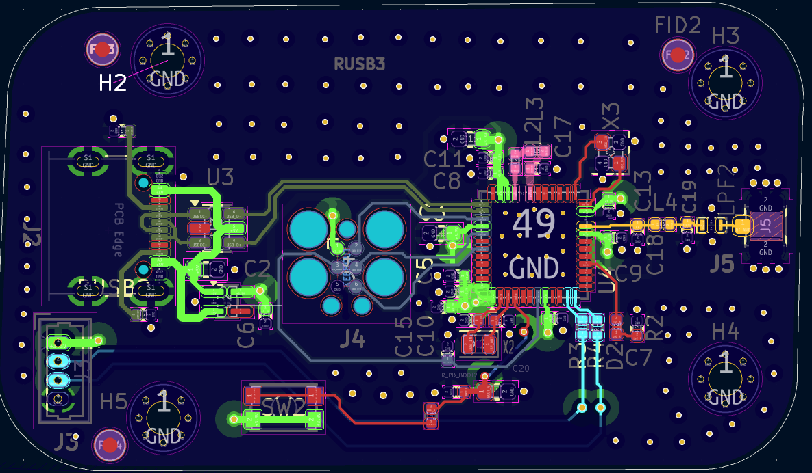
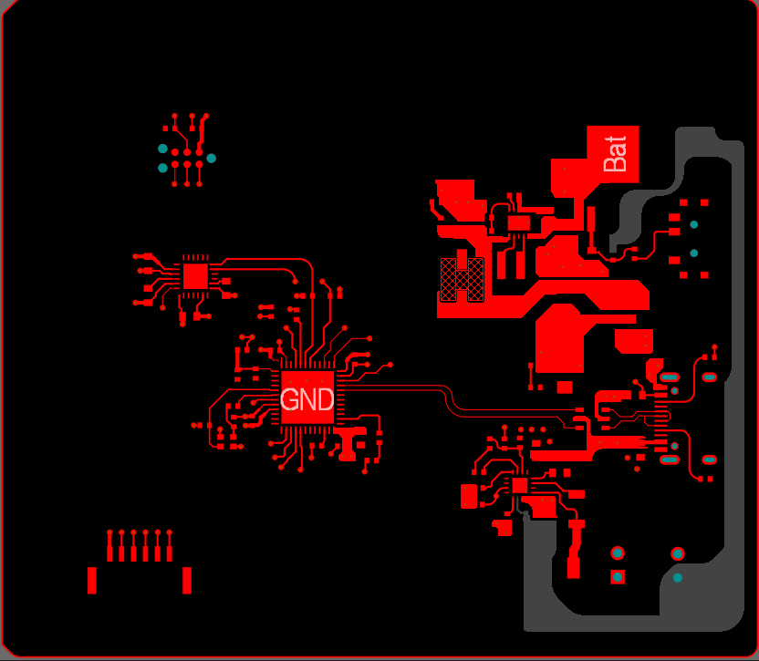

# Embedded systems, RF boards, and instrument repair  
STM32, mixed-signal hardware, Python vision systems  
Focus on debugging, calibration, and system-level faults  

---

## Field Work / Service

### Precision Instrument Service Technician

Repair and calibration of Topcon total stations and auto levels.

- Serviced 200+ instruments under manufacturer procedures  
- Calibrated optical alignment and compensator systems  
- Diagnosed PCB faults and repaired vertical encoders  

  

Encoder disassembly and fault correction affecting angle measurement  

---

## Projects

### STM32 Wireless RF Communication Platform

4-layer RF board under shared digital and power noise.

- Designed Sub-GHz RF path with discrete 50Ω matching network  
- Routed controlled impedance RF trace without vias  
- Integrated USB and RF on shared 3.3V supply  

  

RF trace and matching network placement  

---

### STM32 Mixed-Signal Control Board

STM32 + IMU system operating with switching regulator noise.

- Designed 4-layer PCB with ground and 3.3V planes  
- Integrated BQ25303 buck-boost and Li-ion charging  
- Routed I2C and separated sensor from switching region  

  

Separation of switching regulator and IMU control region  

---

### Driver Monitoring System (DMS)

Real-time webcam-based fatigue detection prototype.

- Built pipeline using OpenCV and MediaPipe  
- Extracted EAR, MAR, and head pose signals  
- Applied temporal filtering and heuristic scoring
  
---

## Core Skills

**Embedded Systems**
- STM32F411, 4-layer PCB design  
- Sub-GHz RF, 50Ω matching  
- Buck-boost power, Li-ion systems (BQ25303)  
- IMU integration (MPU-6050)  

**Software**
- Python 3.x  
- OpenCV, MediaPipe, Dlib  
- EAR/MAR extraction, temporal filtering  

**Tools / Work**
- Altium Designer, KiCad 9  
- Multimeter  
- Topcon calibration systems  
- Field repair and instrument servicing  
